# UWB-based-IoT-robot

代码目前正在整理过程中。将会于今年（2023年）年底前公开。
-------------------------------------------------------------------------------------------------------
The code is currently being compiled and will be publicly available before the end of this year (2023).

1.1项目概述
1.1.1研究背景综述
  虽然无线定位技术发展多年，但目前超宽带技术仍处于发展初级阶段，精确定位技术的商业化正在进行之中。立足现实生活，将UWB定位技术应用于家居环境中的案例相对较少。然而该项技术的广泛运用不仅具有较高价值，并且相比于其他的定位技术，UWB的运用能够在定位方面克服诸多不足，如定位精度的提升。而且能够将定位与通信在同一套系统中实现，大大的拓宽了其在实际生活中的应用，尤其是在智能家居领域，该技术能够显著提高家具机器人性能，推动领域发展。
  
1.1.2研究核心简介
  一般而言，室内定位的传统方式几种方式是WiFi定位，惯性导航技术以及蓝牙技术定位。这些传统方式往往有经济，准确度方面等难以权衡的问题。这些问题在超宽带(UWB)定位技术得以解决，这是近年来新兴一项全新的、与传统通信技术有极大差异的通信无线新技术。它不需要使用传统通信体制中的载波，而是通过发送和接收具发射时间极短（如2ns）的窄脉冲（如二次高斯脉冲）通过微分或混频等上变频方式调制到UWB工作频段实现。UWB技术由于功耗低、抗多径效果好、安全性高、系统复杂度低、能提供精确定位精度等优点，在众多无线定位技术中脱颖而出，是未来无线定位技术的热点。
  UWB定位是一种无载波通信技术，利用纳秒至微微秒级的非正弦波窄脉冲传输数据。通过在较宽的频谱上传送极低功率的信号，UWB能在10米左右的范围内实现数百Mbit/s至数Gbit/s的数据传输速率。具有抗干扰性能强，传输速率高,系统容量大发送功率小等优点。
            

基本原理如下：
基站1的发射机在Ta1发射请求性质的脉冲信号，标签在Tb1接收到信号，并在Tb2时刻发射一个响应性质的信号，被基站1在Ta2时刻接收。由此可以计算出脉冲信号在两个模块之间的飞行时间，从而确定飞行距离S。计算公式如下，
S=Cx[(Ta2-Ta1)-(Tb2-Tb1)]/2(C为光速)

三边测量法
仅考虑平面定位，使用三个基站 A、B 、C ，将其作为圆心，以标签到各个基站的距离作为半径做圆，三个圆交点 即为标签位置。实际使用时基站坐标已知，半径信息由TOF-TWF测距方法获取。可得交点的作标为.
 
 三边测量原理图
1.2项目研究意义
随着社会发展，人们对高品质生活的需要愈渐提高，智能家居理念应运而生，家庭物联网成为科技发展的一大弄潮儿。然后，现如今智能家居的核心绝大部分为“智能音响”，如天猫精灵等。本项目产品“UWB无线物联机器人”解决了这一问题，创造出移动式家庭智能管家，在UWB高精度定位基础下，配合语音控制、遥控控制等多种机器人控制方式，并且加载多功能单元，完成路径规划、电器控制、空气质量检测、居室监控等。并且采用UWB进行无线定位，在众多定位方式中有相当大的优势。目前家居机器人普遍采用超声波测距做出位置测算，此方法误差很大且对处理器要求高，导致造价昂贵。而SLAM技术则并未十分成熟，存在很多技术性问题亟待解决。目前研究表明超宽带定位可在实验室环境中达到cm级定位精度。此外，超宽带技术容易与通信结合，将通信与定位融合进同一系统。此项目势必进一步推进智能家居的发展，为人们的生活带来极大的便利。特别是对于老年人或者身体行动不便者，语音控制机器人完成相应指令，可见此项目不仅适用于家居更适用于养老院、医院、残障人士保健院等等。有极大的学术价值、经济价值和实用性。

1.2团队情况
团队在合作模式上主要采取的是分阶段分工合作，在确定大体分工情况下完成对于任务的分配。在工作过程中采取协商-工作-汇总的形式，对于工作内出现的问题，以及阶段性的成果进行总结，在保证完成基本要求的基础上，完成对于项目的实现。

1.3研究过程与阶段性成果记录
研究主要分为下面几个过程逐步开展，时间已在下面标出，突出问题也在有所提出。
1.3.1第一阶段（2018.5-2018.6）
智能家居机器人硬件设计，主要包括运动控制系统、UWB定位系统。主控板配置OLED显示、蜂鸣器报警、按键等外设，硬件平台搭建完成，而第一阶段主要完成的是主控硬件平台的搭建。
1.3.1.1运动控制系统
运动控制系统以Stm32F103ZET6芯片为控制核心，根据红外传感器、UWB定位系统等的数据信息完成机器人运动状态的控制决策，输出PWM波形到驱动模块。机器人采用带编码器的直流电机，构成运动单元的反馈控制，有效调节电机转速。运动控制系统硬件设计如图1.2所示。

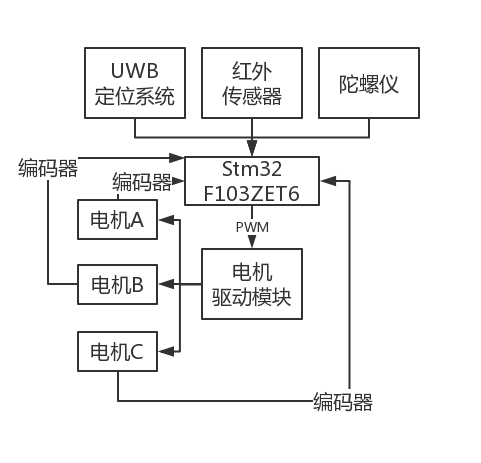
图1.2   运动控制系统硬件设计
1.3.1.2UWB定位系统
在复杂环境下，由于多径效应等的影响，各种方式的定位误差明显增大，UWB（超宽带）定位系统因其独特的通信原理，具有多经分辨率强、功耗低、抗干扰能力强等特点。智能预警超宽带巡逻机器人基于UWB完成其定位系统搭建。主要包括三个Anchor和一个机器人端Tag。
Anchor与Tag硬件设计完全相同。主要包含Stm32主控芯片，DecaWave公司开发的DW1000芯片，二者依靠SPI方式进行数据通信。UWB定位模块负责完成（Anchor-Tag）测距信息的采集、滤波优化。Tag安装于机器人主控板，通过串口将距离数据传输到运动控制系统的Stm32F103ZET6芯片，由其完成机器人实时坐标的解算。定位系统硬件设计如图1.3所示。
 
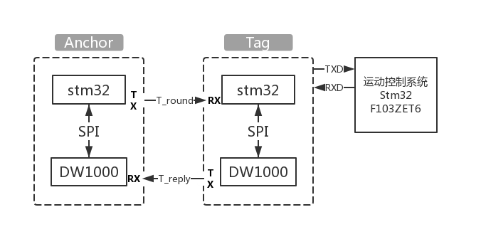
图1.3   UWB定位系统硬件设计

1.3.1.3系统外设配置
人机交互设备则主要包括语音模块，摄像头模块，摄像头主要通过树莓派进行信息传输，可对检测环境进行反应，而外设还包含已红外光电管单元为主的避障单元，家居机器人使用三轮全向轮，三个轮子互相间隔120°，具有良好的运动性和结构简单、易于控制的优势。使得机器人既可沿轮面的切线方向移动，又可沿轮面的轴向方向移动，从而实现平面内任意方向运动，如图1.4所示。

 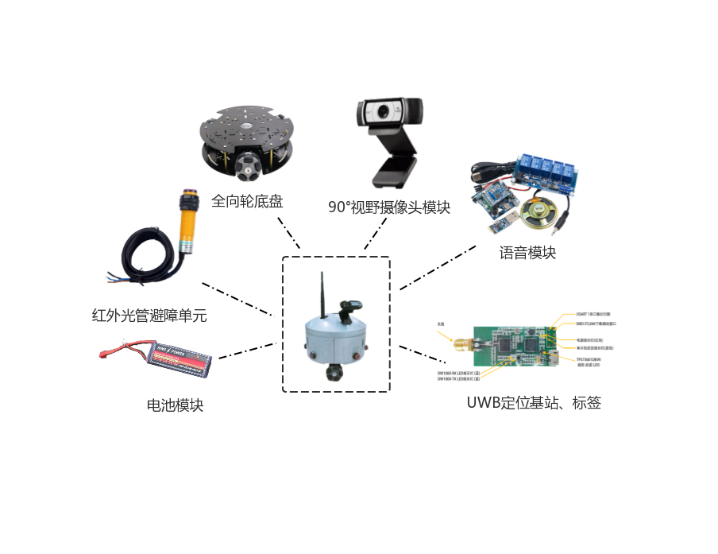
图1.4机器人外设示意图

1.3.2第二阶段（2018.5-2018.8）
1.3.2.1人机交互功能
机器人搭载摄像头，可实时进行数据图像信息的传输，在项目期间对于摄像头采集图像进行处理与传输，增强信息传递过程中的准确性与实时性。
机器人搭载语音模块，可与人进行语音交互，通过语音输入，对于传输过来的信息进行判断，对机器人进行控制，已经指令的收发，实现机器人的智能化，是机器人更加贴近于生活。并在此阶段中已经基本实现其功能。

1.3.2.2 对UWB标签基站电路板进行设计
 UWB定位基于信号飞行时间，因此各节点的时钟精度要求高、信号质量要求高，模块要求使用高频四层PCB板，天线要求50Ω阻抗匹配，UWB模块的自主设计是硬件的一大问题。目前，项目组使用温州研创物联公司开发的UWB套件进行项目设计，如图1.4所示五枚外置棒状天线UWB定位模块。按照项目进度，UWB模块电路板调试仅部分完成，后期需对PCB进一步修改。
新的硬件已经可以使用，并已经对于相关部分与功能进行了完善。
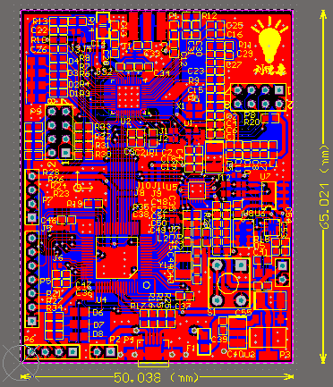
图1.5 主控板设计PCB图

1.3.2.3实现多标签的识别定位
    基于无线物联定位的家居安全防护系统，欲使其有足够的经济效益，同一组基站范围内，需支持足够的标签数目。对UWB模块进行二次开发，研究修改原模块配置指令，成功使标签数目由64枚拓展至500枚。地址扩建后，系统存在了刷新率降低的问题，即主基站读取数据速率变慢，解决方法为进一步提高主基站处理数据的速率，这是接下去研究方向之一。标签数目的增加使得标签更具有普适性，是标签能够在范围内多家不同地址，放在标签之间的干扰。
模块 	指令 	模块 	指令 	模块 	指令 
基站 A0 	AT+SW=1001000 	标签 T0 	AT+SW=1000000 	标签 T4 	AT+SW=1000004 
基站 A1 	AT+SW=1001001 	标签 T1 	AT+SW=1000001 	…… 	……
基站 A2 	AT+SW=1001002 	标签 T2 	AT+SW=1000002 	标签 T499 	AT+SW=1000499
基站 A3 	AT+SW=1001003 	标签 T3 	AT+SW=1000003 	标签 T500 	AT+SW=1000500 

表1.6 模块配置指令

1.3.3第三阶段（2018.7-2018.10）
1.3.3.1 实现双向通信调试
采用双路（TWR）测距算法，该算法采用双向测量，不需要进行节点间的数据同步。则数据包在空中传递的实际时间为：
 
 为节点Ａ发出 数据包到接收到Ack数据包用的时间； 为节点Ｂ收到 数据包到发出Ack包所用的时间； 为节点B发出 POLL数据包到接收到Ack数据包用的时间； 为节点A收到Poll数据包到发出Ack包所用的时间，此方法如图3.1.1所示。
误差项：设节点Ａ的频率偏差为 节点Ｂ 的频率偏差为 。加上误差后，数据包的传递时间为：
 
 。
基站-标签间距离为：
 
其中c为光速， 为往返总时间，D为两者距离。
 
图 测距过程描述
UWB 定位单元与 stm32 控制单元通过串口进行数据通信。stm32 接收来自 UWB 通过串口传出的 TOF Report Message 数据流，通过三边测量法计算标签坐标，并显示于 OLED。
mr	1	972	-338	-338	-338	2249	119	1641816418	a0:0
mr	1	944	-338	-338	-338	2250	120	1641816418	a0:0
mr	1	963	-338	-338	-338	2251	121	1641816418	a0:0
mr	1	931	-338	-338	-338	2252	122	1641816418	a0:0
mr	1	926	-338	-338	-338	2253	123	1641816418	a0:0
表 1.7 TOF 数据流
如表 1.7 所示，该表为基站-标签实际距离 1m（仅使用基站 0 与标签）时的串口数据流。在 stm32 中编写 trilateration.c 程序，提取数据流中的距离信息，并获取基站实际布置坐标，完成解算定位。数据流各元素含义如下：
mr:消息ID，表示基站、标签距离原生数据（未进行优化修正的数据）
1：MASK，表示后面四个Data哪几个有效，1表示第一个有效
Data1：基站0与标签TOF测距信息。真实距离1m，测试距离947.2mm，原生数据误差52.8mm。
Data2、Data3、Data4此时因无相应基站设置，数据无效，后续为官方设置信息，不予赘述。
 
图1.8 机器人OLED标签坐标显示图

1.3.3.2 测试数据并进行算法优化
极值最小二乘法
	为保证系统在扰动下的定位可靠性，减少UWB定位的数据抖动，提出“去极值最小二乘法”进行定位轨迹预测跟踪。定位过程中，下一时刻预测值 仅与当前时刻以及之前的 个值有关，而与更远的历史值无关。由已知数据序列 、 、 …… ，根据最小二乘法原理可对 进行预测。并对序列作去极值处理，使用于拟合的数据分布更为集中。该算法运算量小，实时性高，同时随着数据的动态变化，用于拟合的数据序列以固定长度在历史数据中滑动，保证良好的预测效果，解决了UWB定位因遮挡或其他扰动导致的定位缺失问题。
设假设的拟合函数模型为：
 
其中 。
令
 。
其中 为数据样本，m代表有m个等式，n代表有n个未知数， 。根据最小二乘法原理，若使 最小，则 ，其中 
即 
得方程组：
 
求解得拟合方程 ， 为最高次幂。
优化结果：
去极值最小二乘法仿真采集了机器人运动过程中的一段数据，在 Matlab中分别使用普通最小二乘法与去极值最小二乘法进行预测跟踪，其中数据序列长度 5 ，拟合函数最高次幂为 2 ，仿真结果如图所示。
去极值最小二乘法可有效跟踪实际运动轨迹，并在 UWB 定位缺失时提供可靠的预测结果。与普通最小二乘法相比，可有效去除数据抖动、提高平滑性。UWB 报警区域报警效果实验结果与分析
人的行走速度和报警区域的大小都会影响系统的报警正确率。选择以 60.7 cm 为边长的正方形区域作为初始测试区域，每次面积缩小一半且保持正方形形状不变，将人的运动速度分为 5 个等级： 1 级（ 0~0.48 m/s ）；2 级（ 0.48~0.72 m/s ）； 3 级（ 0.72~0.96 m/s ）； 4 级（ 0.96~1.20 m/s ）； 5 级（ 1.20~1.44 m/s ）。保持测试面积不变，在同一测试面积下让人以 5 种不同的行走速度通过该区域，然后测试人通过该报警区域时后台的报警成功率，具体如表 1 所示。由表可知，在边长为 21.24 cm 的正方形以上的报警区域，在 5 种速度下报警率为 100% ；在边长为21.24 cm 的正方形以下的报警区域报警率随着人的速度增大而减小。实验结果满足系统所需要的高报警率的要求。

 
 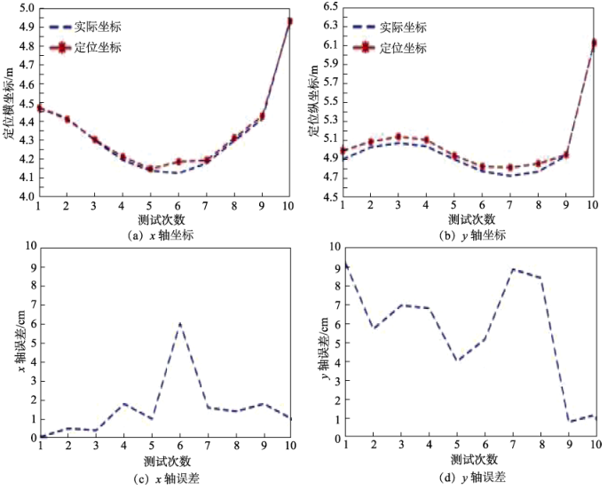
图1.9 UWB 室内定位实验结果分析
  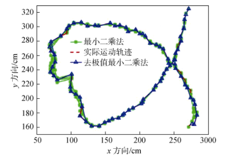
图1.10 去极值最小二乘法仿真
  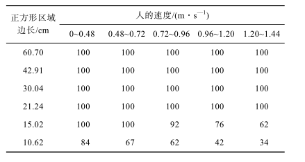
图1.11 报警区域内报警成功率

算法优化定位精度优化、数据抖动问题解决：
在空旷条件下UWB定位精度稳定于10cm内，但家居现场环境复杂，既有大范围的无遮挡视距区域，也有遮挡严重场所，同时遮挡物种类较多，这些是家居现场UWB定位精度降低的主要原因。针对精度优化、抖动问题解决，我们主要是在“硬件”、“软件”两方面进行考虑的。
惯性元件在UWB信号受遮挡而误差极大时有很好的辅助作用，而惯性元件又因为积分运算的原因，长时间工作将产生积累误差，而UWB定位可弥补此缺陷即可初始化陀螺仪，消除积累误差。在与导师讨论后，我们决定使用“UWB+惯性导航”组合定位的方式。因为工人在工作过程中，由于遮挡或其他干扰使得UWB定位误差大时，系统可能出现危险误报、定位失准等问题，惯性元件的加入有效预防了此类问题的发生采取的方法如下

对优化后报警效果进行测试
虚线同心圆表示人为设定的危险区域与自动生成的报警区域，小点代表报一次警机器人的位置，加号代表了未报一次警机器人的位置，叉号代表了报警失误一次机器人的位置。机器人在沿着报警区域边界运行时共测试了 7700 次，其中失报了 12 次，失报率为 0.15% ；机器人在报警区域内运行时共测试了 2500 次，其中误报了 9 次，误报率为 0.36%。
   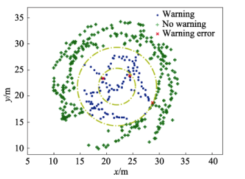
图1.12 UWB报警区域效果图

算法优化图像识别系统：
机器人加载Faster R-cnn是基于CNN的的网络，在Fast-Rcnn的基础上添加了区域生成网络（RPN）,通过共享网络结构而避免了重复计算。网络结构如图1.13所示：
    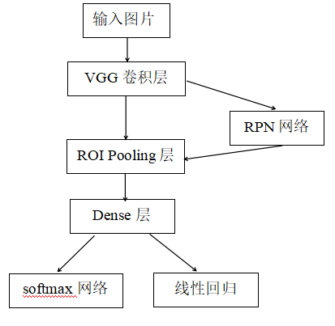
图1.13  Faster R-cnn网络结构
Faster-Rcnn分为四个主要部分：
（1）卷积层：使用VGG16网络提取图片的特征图。该特征图被共享后用于后续的RPN层和全连接层（Dense）。
（2）区域生成网络（RPN）:RPN网络用于生成候选区域。该层通过softmax网络判断锚框属于前景或者背景，再利用线性回归修正锚框获得精确的区域。
（3）ROI Pooling层：该层收集输入的特征图和区域，综合这些信息后提取区域特征图，送入后续全连接层判定目标类别。
（4）分类：把区域特征图输入softmax网络分类出区域的类别，同时再次线性回归获得检测框最终的精确位置。 

1.3.3.3完成语音识别部分工作
   实现了用户可通过语音指令控制机器人行动，语音识别支持500句对话扩展，有很高的实用价值。机器人可通过“学习”作为任意红外控制电器开启媒介，与UWB定位及语音识别相互配合，即可完成指定位置、指定电器打开或关闭。为家居生活提供便利与快捷。

1.3.4第四阶段（2018.10-2019.2）
1.3.4.1更新优化主控电路板
机器人以STM32单片机为主控芯片，围绕其搭建硬件电路，包括稳压电源单片、传感器接口、UWB串口数据传输、ADC电压监测等。
采用LD3320语音识别芯片，通过对MIC输入的声音进行频谱分析、特征提取、关键词匹配从而得到识别结果，经实际测试机器人语音识别功能识别率高、响应快。
UWB模块则采用Decawave公司研发的dw1000芯片，制作高频四层PCB板，并精确调整50Ω阻抗匹配。但因制作周期长，尚未完成样机调试。遂机器人应用温州研创物联公司研发的UWB基站、标签模块，待进一步调试完成机器人硬件即可实现全自主开发、焊接、调试、应用。
    对于主控板进行了整体的优化提升。如图1.14  1.15所示。

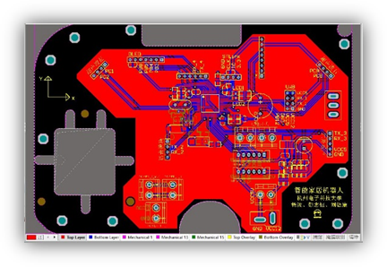       
           1.14 UWB物联机器人控制板        
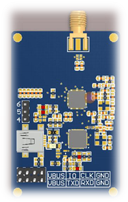
           1.15  UWB基站、标签模块（自制）

1.3.4.2进行摄像头调试及家居环境测试单元调试
    机器人装载图像识别，可对于人脸进行检测抓取保存，并通过算法优化，使得机器人系统在高识别率与准确度的情况下，实现对于人脸的抓取图像的局域网内传送，是用户可通过后台(包括手机端与电脑端）对于摄像头采集数据的检测。

1.3.5第五阶段（2019.3-2019.4）
对成品进行测试与改进
    成品设计完成，使家居智能机器人在高精度超宽带的基础上，实现了通过语音交互或者后台指定实现对于指定点的到达，危险区域的预警，经过团队努力，最终实现以UWB定位为基础实现机器人在居室内的定位导航，通过语音控制操作机器人可实现用电器开启，危险区域报警等。团队考虑到家庭生活中小孩子非常容易跑到阳台、厨房等，遂增加机器人跟随功能，一旦发现孩子进入危险区可立即语音报警。UWB物联机器人拥有上位机可实时显示机器人轨迹路径，可向机器人发送指定位置区域坐标。机器人软硬件系统实现高度契合，有稳定的效果及数据传输效率。实现了如下功能：
语音识别
采用关键词“小宝”，可以唤醒机器人，使用语音控制可以切换不同的控制模式，用户可以轻松的与机器人进行互动增加乐趣性，也可以解放人们的双手不用进行繁杂的操作。
家电控制
机器人可以支持家电控制，使用红外开关，可以对家中的电器进行控制。
定点到达
机器人与配套APP配合，APP支持家用地图导入，在APP上可以实时显示机器人在家中的位置，也可以显示机器人的轨迹。在APP上可以圈定指定位置让机器人到去达指定位置。
 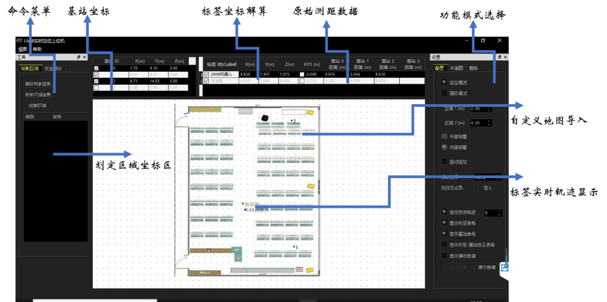 
图1.16  后台软件界面示意图
通过上位机的采集轨迹进行上位机进行曲线轨迹递推最小二乘处理之后的，曲线更加平滑。
具体曲线如下图所示。
   
图1.17 递推最小二乘曲线平滑处理
智能跟随报警
机器人有配套UWB标签，由小孩佩戴。上位机可以实时追踪小孩轨迹。并且在上位机上可以圈定电子围栏，小孩如果到达电子围栏外。机器人会跟踪报警，提示家长注意小孩的安全。

图像人脸识别传输
    机器人搭载摄像头可通过树莓派进行人脸识别与图像采集，通过无线传输，实现家人对于居室内环境的实时检测，可通过后台（包括pc端和手机端）对于图像进行实时的监控，已实现了图像信息在局域网内的传输。

